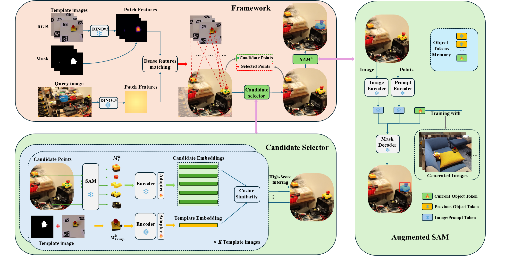
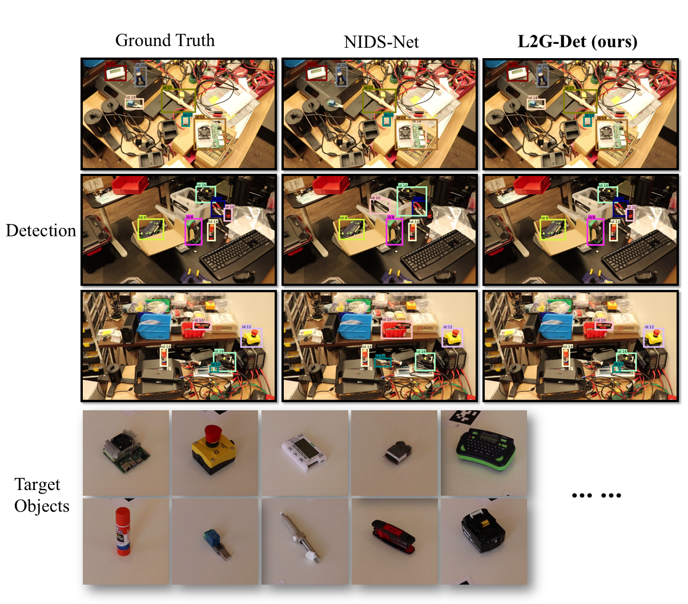
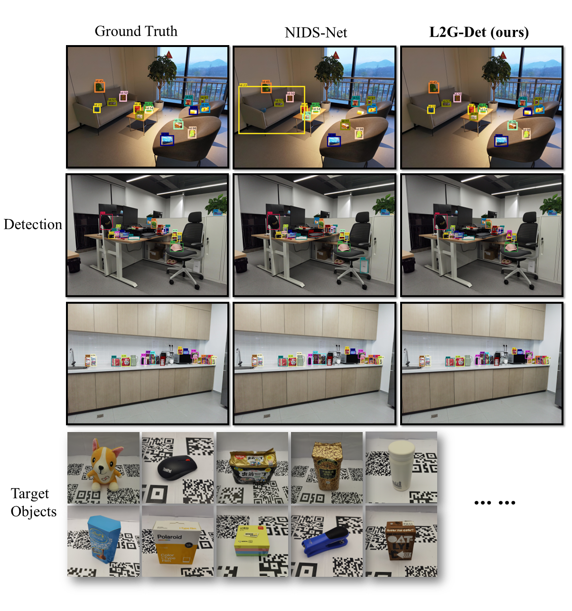
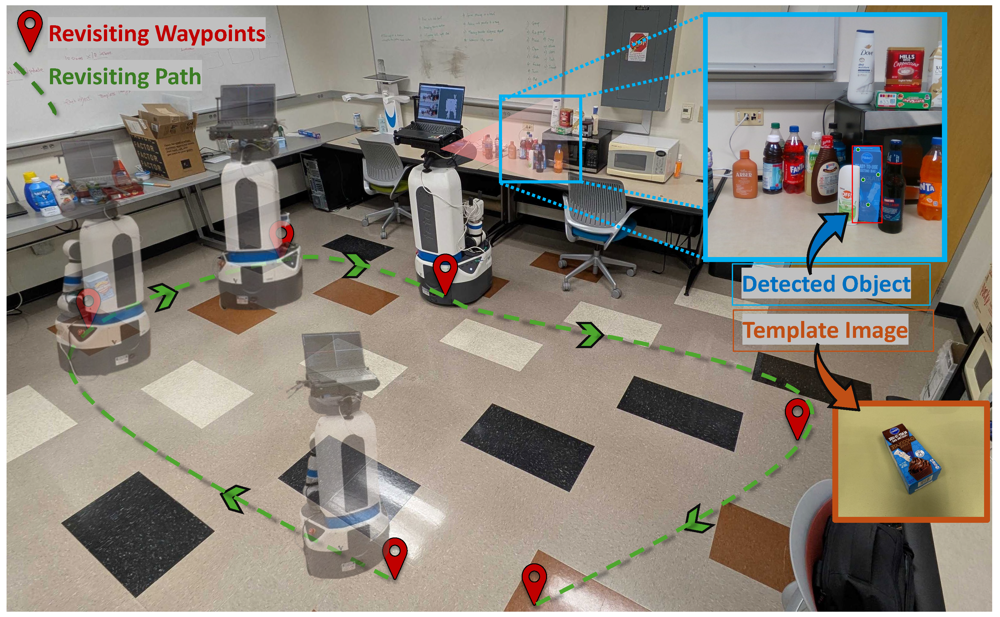

# L2G-Det


**From Local Matches to Global Masks: Template-Guided Instance Detection and Segmentation in Open-World Scenes**


[arXiv](https://arxiv.org/abs/2603.03577), [Project](https://irvlutd.github.io/L2G/)

> Detecting and segmenting novel object instances in open-world environments is a fundamental problem in robotic perception. Given only a small set of template images, a robot must locate and segment a specific object instance in a cluttered, previously unseen scene. Existing proposal-based approaches are highly sensitive to proposal quality and often fail under occlusion and background clutter. We propose L2G-Det, a local-to-global instance detection framework that bypasses explicit object proposals by leveraging dense patch-level matching between templates and the query image. Locally matched patches generate candidate points, which are refined through a candidate selection module to suppress false positives. The filtered points are then used to prompt an augmented Segment Anything Model (SAM) with instance-specific object tokens, enabling reliable reconstruction of complete instance masks. Experiments demonstrate improved performance over proposal-based methods in challenging open-world settings.

## Framework


## 📸 Detection Examples

### RoboTools

<p align="center">
  
</p>

### High Resolution

<p align="center">
  
</p>


## Getting Started
 
### Prerequisites
- Python 3.10
- torch (tested 2.6)
- torchvision

### Installation
We test the code on Ubuntu 20.04.
```sh
git clone https://github.com/IRVLUTD/L2G.git
cd L2G
# Create the conda env
conda create -n L2G python=3.10
conda activate L2G
# Install PyTorch
pip install torch==2.6.0+cu118 torchvision==0.21.0+cu118 torchaudio==2.6.0+cu118 --index-url https://download.pytorch.org/whl/cu118
# Install other packages
pip install -e.
```

### Preparing models

- [Dinov3](https://utdallas.box.com/s/5sq36cepn1ixw6nqvisj4s5rflyzu7zr)
- [SAM](https://utdallas.box.com/s/32q46julpez5upv8dscvkizkpkcyhl93)
- [Adapter](https://utdallas.box.com/s/114ci0k68mtrcwyt6uoq34nye1obzscu)
- [Object_tokens](https://utdallas.box.com/s/omqe0hisharujwk9uc2h6hx3btcli4kn)

Please put them into "checkpoints" folder as follows:
```
checkpoints/
├── dinov3/
│   └── dinov3_vitl16_pretrain_*.pt
│
├── SAM/
│   └── sam2.1_hiera_large.pt
│
├── Adapter/
│   ├── High_Res_Adapter.pt
│   └── RoboTools_Adapter.pt
│
├── Object_tokens_High_Res/
│   ├── full_mask_tokens_000001.pt
│   ├── full_mask_tokens_000002.pt
│   ├── ...
│
└── Object_tokens_RoboTools/
    ├── full_mask_tokens_000001.pt
    ├── full_mask_tokens_000002.pt
    ├── ...

```

### Preparing Datasets
<details>
<summary> Setting Up Detection Datasets </summary>


#### The RoboTools dataset is divided into 24 scenes (Scene 1–24). Download the dataset: 
- [Query](https://utdallas.box.com/s/53igfvlqtfg0bl28qnow8eolr2fx4sjk)
- [Templates](https://utdallas.box.com/s/jnenedqmc7i9ftfawn4adjg3opapqzq1)

#### The High_Resolution dataset is divided into 22 scenes (Hard : Scene 1–10; Easy: Scene 11-22). Download the dataset: 
- [Query](https://utdallas.box.com/s/h2idi4glitwc0g55mxcx2kk0uhywfk3k)
- [Templates](https://utdallas.box.com/s/d946h9a0m46sh7hrqlsdgaxdvmjube3q)

Please put them into "Data" folder as follows:
```
data/
│
├── Query/
│   ├── High_Resolution/
│   │   ├── 000001/
│   │   ├── 000002/
│   │   └── ...
│   │
│   └── RoboTools/
│       ├── 000001/
│       ├── 000002/
│       └── ...
│
└── Templates/
    ├── High_Resolution_all/
    │   ├── rgb/
    │   │   ├── 000001/
    │   │   ├── 000002/
    │   │   └── ...
    │   └── mask/
    │       ├── 000001/
    │       ├── 000002/
    │       └── ...
    │
    └── RoboTools_all/
        ├── rgb/
        │   ├── 000001/
        │   ├── 000002/
        │   └── ...
        │
        └── mask/
            ├── 000001/
            ├── 000002/
            └── ...
```
</details>

### Usage

#### Demo
You can directly run the demo:
```sh
python run.py --config Demo.yaml
```
or check [inference on the image](notebooks/inference_demo.ipynb)

#### Benchmark

Sample the template images: 
```sh
cd tools

# --n 8          : Number of templates to sample per object
# --datasets     : Dataset name (e.g., RoboTools; High_Resolution)
python sample_templates.py --n 8 --datasets RoboTools
```

Run L2G on the Benchmark:
```sh
python run.py --config RoboTools.yaml  #or High_Res.yaml

# then merge results using tools/utils/merge.py. You can download Ground truth files in the following link.
```

We include the ground truth files and our predictions in this [link](https://utdallas.box.com/s/3cc1gcohdluudc37ezcebf5nj9szdur9). You can run [eval_results.py](tools/eval_results.py) to evaluate them.


### Create the template-based training images

Download the background with the [link](https://utdallas.box.com/s/i5xf5mlyg0vq0ie38f8hksjzdjf1s7y0). Among these, **Backgrounds_2048** is constructed by cropping local regions from the original high-resolution background images, resulting in images of size 2048 × 1536.

```sh
# Create the template-based training images on RoboTools
python tools/Compose_objects.py \
--objects-root data/Templates/RoboTools_all \
--backgrounds Backgrounds_2048 \
--out-root RoboTools_create \
--bbox-out-root RoboTools_create_bbox \
--start-object-id 1 \
--end-object-id 20
```

### Training
Check the [training demo](notebooks/Training_demo.ipynb) in notebooks.


### Real-World Robot Experiment
Click the following image to watch the video.

[](https://youtu.be/b9lV50FqkfA)

## Acknowledgments

This project is based on the following repositories:
- [Dinov3](https://github.com/facebookresearch/dinov3)
- [SAM2](https://github.com/facebookresearch/sam2)
- [Perception_models](https://github.com/facebookresearch/perception_models)
